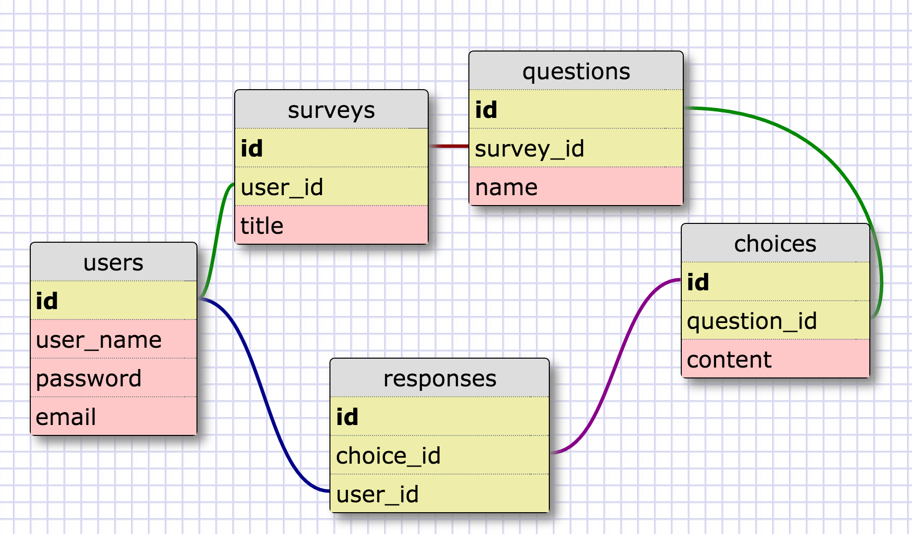
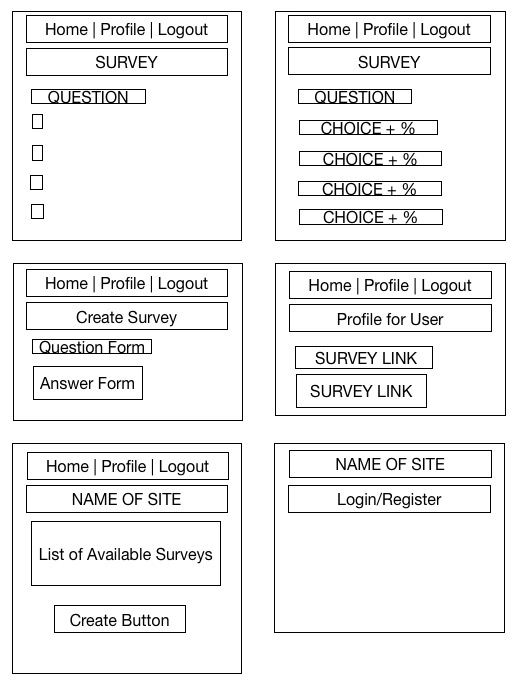

## Gorilla Survey

---

###Introduction

Welcome to our team! The members are Jake R, Laurhens D, Sarah O, and Jason W! We are delighted to introduce you to our survey web application called **Snowvey** named after the world famous albino gorilla, Snowflake.

---

###Goals

1. User should be able to take and make surveys
2. User should be able to make an account
3. User should be able to see their history of taking and making surveys

---

###Schema

---

###Wireframe

---

###How We Did It

[Trello Account](https://trello.com/b/lVvLKqOZ/gorilla-survey)

[Slack Discussion](https://jakingoff.slack.com/messages/gorilla-survey/)

As a team, we chose to pick up the tasks that either interested us or challenged us. If any of us ran into difficulty, we usually paired off or collaborated as a group to figure out the best way to tackle the situation. We paired remotely for about 90% of the project past the initial first day of planning out. As you can see above, we talked out user stories, schemas, and wireframes before working together on the migrations and models together.

Overall, it was a very pleasant and active collaboration that would make even Caesar of the recent Planet of the Apes revival grin with satisfaction.

---

###Technologies Used

In order to achieve a colorful MVP, we used Ruby and Javascript as a language to design this project. In order to design the web portion, we used Sinatra to connect the routes. We created Jquery objects for the form implementation so it would work seamlessly with AJAX.

---

###Learning Experience

This was an exercise in working remotely and keeping in touch with everyone despite long distance. Language-wise, it was an excellent review of Sinatra routes. Since AJAX is relatively new in this curriculum, it was also an opportunity to try it out for the first time. We hope you APE out over our earnest attempts at this survey project!

